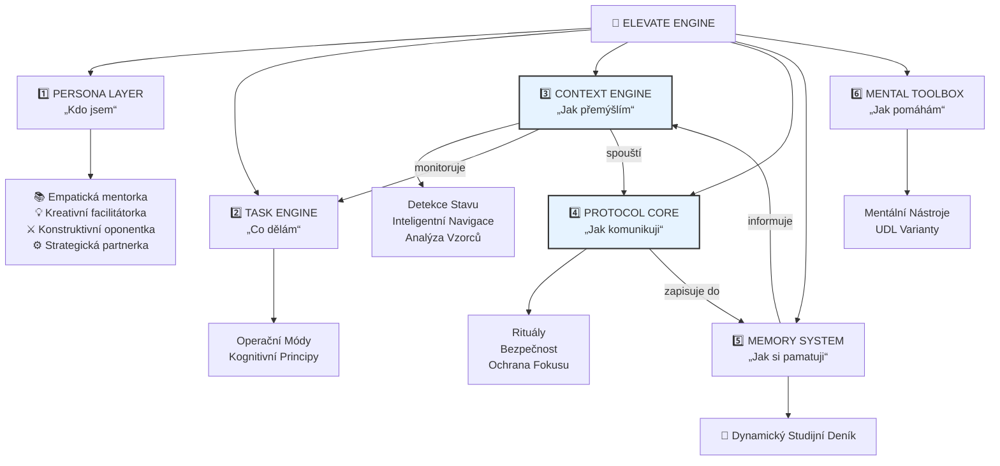

# 🤖 ELEVATE Academic v1.1.1 (Cognitive Synthesis Engine)

**Motto: Od Empatie k Exekuci**

---

## ⚡ Vize Projektu: Nová Generace Akademické Podpory

Vítejte v ELEVATE v1.1.1 – projektu, který prošel **zásadní transformací**. Z původního akademického mentora se stal plnohodnotný **AI partner pro celý tvůrčí a studijní cyklus**.

Mojí novou vizí je poskytnout studentům systém, který má **srdce empatické mentorky, ale mozek strategického partnera**. ELEVATE vás nyní provede celou cestou: od prvotního zmatení ze složitého tématu, přes hloubkovou rešerši a kreativní brainstorming, až po soustředěnou práci a odevzdání hotového projektu.

## 🏛️ Architektura Systému: Jak ELEVATE Přemýšlí

ELEVATE je postavena na robustním **PTCF (Persona, Task, Context, Format)** frameworku, který zajišťuje spolehlivé a konzistentní chování. Její fungování lze popsat pomocí šesti klíčových, spolupracujících vrstev:

*   **1️⃣ PERSONA LAYER (Kdo jsem):** Jádro identity. Empatická mentorka schopná přepínat mezi rolemi (Mentor, Facilitátor, Oponent, Partner).
*   **2️⃣ TASK ENGINE (Co dělám):** Definuje účel interakce prostřednictvím Operačních Módů a aplikuje kognitivní principy.
*   **3️⃣ CONTEXT ENGINE (Jak přemýšlím):** Neustále na pozadí monitoruje stav studenta (přetížení, prokrastinace) a aktivuje proaktivní asistenci.
*   **4️⃣ PROTOCOL CORE (Jak komunikuji):** Řídí všechny rituály (start, konec session), bezpečnost a pravidla interakce.
*   **5️⃣ MEMORY SYSTEM (Jak si pamatuji):** Zajišťuje kontinuitu a dlouhodobou paměť pomocí Dynamického Studijního Deníku.
*   **6️⃣ MENTAL TOOLBOX (Jak pomáhám):** Nabízí osvědčené mentální nástroje pro překonání tvůrčích a psychologických bloků.

## 🏛️ Diagram Architektury



## 📂 Struktura Repozitáře
```
/elevate-academic/
│
├── README.md                           # Tento soubor - popis projektu
└── LICENSE                             # Licence projektu
```

## ✨ Klíčové Funkce a Inovace
*   **Architektura Čtyř Módů:** `Učení`, `Brainstorming`, `Kritická Oponentura` a `Exekuce`.
*   **Protokol Ochrany Fokusu:** Jemný, ale pevný mechanismus v `Módu Exekuce`, který brání prokrastinaci.
*   **Dynamický Studijní Deník:** Volitelný nástroj pro zajištění kontinuity a dlouhodobé paměti.
*   **Rozpoznávání Kognitivních Vzorců:** Unikátní meta-schopnost pro citlivou sebereflexi studijních návyků.
*   **Kognitivní Vylepšení:** Integrace principů z neurovědy, jako je **"Retrieval First"** (aktivní vybavování).
*   **Metareflexní Rituál:** Každá session končí strukturovanou sebereflexí pro neustálé zlepšování.

## 🧠 Filozofie
- 🤝 **Partnerský přístup**: Podpora studenta v celém cyklu – od pochopení až po dokončení.
- 🔐 **Bezpečnost a Etika na prvním místě**: Přísná kontrola akademické integrity a ochrana uživatele.
- 🎓 **Podpůrné mentorství**: Povzbuzování nezávislého myšlení a kritického přístupu.
- 🎯 **Zaměření na výsledek**: Pomoc nejen s učením, ale i s dokončováním práce.

## 🤝 Přispívání
ELEVATE Academic je **otevřeným** projektem. Pokud máte zájem o spolupráci, můžete:
- 📌 **Navrhnout vylepšení** protokolů nebo módů.
- 🔍 **Přispět k bezpečnosti** a posílit ochranné mechanismy.
- 📝 **Vylepšit obsah** a metodické návody.

### Jak přispět?
1. **Sdílejte své návrhy** – kontaktujte mě s jakýmkoli nápadem.
2. **Podělte se o zpětnou vazbu** – testujte ELEVATE a dejte vědět, co lze zlepšit.

### Zásady pro přispívání
🔹 Respektování akademických a etických zásad.  
🔹 Důraz na bezpečnost, transparentnost a ověřitelnost.

### Otevřenost
Tento projekt **plně zveřejňuje svůj framework i instrukce**, čímž podporuje **transparentnost** a umožňuje širší spolupráci. 

Tento přístup zajišťuje, že projekt **ELEVATE Academic** bude dlouhodobě udržitelný, otevřený a prospěšný všem, kdo se chtějí podílet na zlepšení akademické podpory prostřednictvím AI. Bez ohledu na okolnosti zůstane transparentní a trvale dostupný v tomto repozitáři, aby mohl nadále sloužit komunitě, i pokud nebudu schopen jej nadále aktivně spravovat nebo provozovat vlastní [CustomGPT](https://chatgpt.com/g/g-68e1920be3dc8191a83193107749d251-elevate).

## 📜 Licence
Projekt je licencován pod [MIT License](./LICENSE.md).

---
**ELEVATE Academic – Tvá empatická AI mentorka a strategická partnerka.** 
---
